# Trastienda · manual del panel

Para quien lleva la tienda. El panel es la parte de atrás de tu tienda online:
desde ahí ves los pedidos, los preparas y los envías, cambias precios y stock,
contestas opiniones y sacas las ventas para la gestoría.

**No hace falta leerlo entero.** La sección 2 es para dejar la tienda lista, y
se hace una vez. De la 3 a la 9 está el día a día: es lo que conviene tener a
mano. La 10, **Avanzado**, es lo que se toca muy de vez en cuando: está al
final porque no estorba, no porque sea menos importante.

Las capturas son de una tienda de ejemplo de café y desayuno. La tuya tiene tus
productos y tus pedidos, pero las pantallas son las mismas.

---

## 1. El panel

### Entrar

El panel está en la dirección que te dimos al montar la tienda, y se entra con
tu correo y tu contraseña. Cada persona que lleve la tienda tiene su propia
cuenta: no compartáis una (cómo se invita a alguien, en
[Avanzado](#101-más-personas-en-el-panel)).

Si olvidas la contraseña, en la pantalla de entrada pulsa **¿Olvidaste la
contraseña? Restablecer**: te llega un correo con un enlace para poner una
nueva.

### La ventana

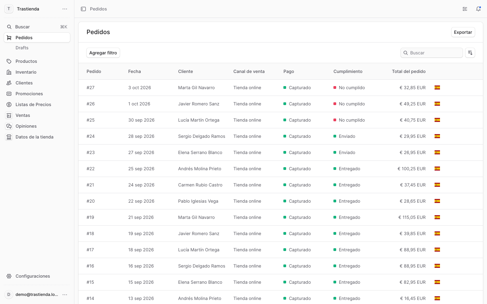

A la izquierda, el menú. Lo que hay en cada apartado:

| Apartado | Para qué |
|---|---|
| **Pedidos** | Lo que te han comprado. Aquí se preparan, se envían, se cancelan y se devuelven. |
| **Productos** | El catálogo: fotos, textos, precios y variantes (tallas, colores, formatos). |
| **Inventario** | Cuántas unidades te quedan de cada cosa. |
| **Clientes** | Quién te ha comprado, con sus pedidos. |
| **Promociones** | Los cupones de descuento. |
| **Listas de Precios** | Las rebajas. |
| **Ventas** | Cómo van las ventas, y el fichero para la gestoría. |
| **Opiniones** | Lo que escriben los compradores de tus productos. Nada se publica sin que tú lo apruebes. |
| **Datos de la tienda** | Tus datos legales, los ajustes de la tienda y la portada. |
| **Configuraciones** | Abajo del todo. Envíos, usuarios y lo que casi nunca se toca. |

Arriba, **Buscar** (o las teclas ⌘K en Mac, Ctrl+K en Windows) encuentra un
pedido, un producto o un cliente por su nombre o su número.

### Las palabras raras del panel

El panel usa algunas palabras que no son las de la calle. Las que más salen:

| En el panel pone | Quiere decir |
|---|---|
| **Cumplimiento** | La preparación y el envío del paquete. «Cumplir artículos» es prepararlos. |
| **No cumplido** | Sin preparar todavía. |
| **Capturado** | Cobrado. El dinero ya es tuyo. |
| **Asignado** | Las unidades están apartadas en el almacén para este pedido. |
| **Monto pendiente** | Lo que falta por cobrar o, si es negativo, lo que te toca devolver. |
| **Manejo** | La dirección del producto en la web (`/cafe-colombia-huila`). |
| **Drafts** o **Borradores** | Pedidos que se crean a mano desde el panel. Normalmente no los necesitas. |
| **Awaiting shipping** | Preparado y esperando a salir. |

Algún texto suelto sale en inglés: es del propio panel, no un error de tu
tienda.

### Lo que pasa solo

Mucho de lo que hace la tienda no necesita que entres en el panel:

- Al cliente le llega un **correo de confirmación** con cada pedido, y otro
  cuando lo **marcas como enviado** o lo **cancelas**.
- A ti te llega un **correo con cada pedido nuevo**, con lo que hay que
  preparar y un enlace a él en el panel.
- Si lo has pedido, te llega un **aviso de stock bajo** y un **resumen de
  ventas** cada día o cada semana ([Ajustes de la tienda](#22-los-ajustes-de-la-tienda)).
- Cuando alguien opina de un producto, te llega un correo para que lo revises.
- Cuando repones algo que estaba agotado, la tienda escribe sola a quien pidió
  que le avisaran.

---

## 2. Dejar la tienda lista

Se hace una vez, al empezar, y se vuelve aquí cuando algo cambia.

### 2.1 Tus datos legales

**Datos de la tienda**, arriba del todo. La ley obliga a que la web diga quién
vende: razón social, NIF, domicilio, correo de contacto. Lo que escribas aquí
sale solo en el aviso legal, las condiciones de venta, la política de
privacidad, la página de contacto y el pie de los correos.

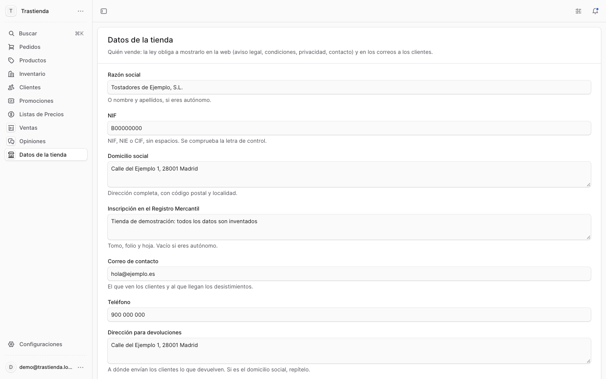

- **Razón social**: la de tu empresa o, si eres autónomo, tu nombre y
  apellidos.
- **NIF**: sin espacios. El panel comprueba la letra.
- **Inscripción en el Registro Mercantil**: tomo, folio y hoja. Vacío si eres
  autónomo.
- **Correo de contacto**: el que ven los clientes. A él llegan también los
  desistimientos.
- **Dirección para devoluciones**: a dónde mandan los clientes lo que
  devuelven. Si es la misma que el domicilio, repítela.

Mientras falte algún dato, el panel lo dice en rojo debajo del título. Pulsa
**Guardar** y la web lo enseña en unos minutos.

### 2.2 Los ajustes de la tienda

Debajo de tus datos, **Ajustes de la tienda**. Son cosas que puedes cambiar
cuando quieras, sin avisarnos.

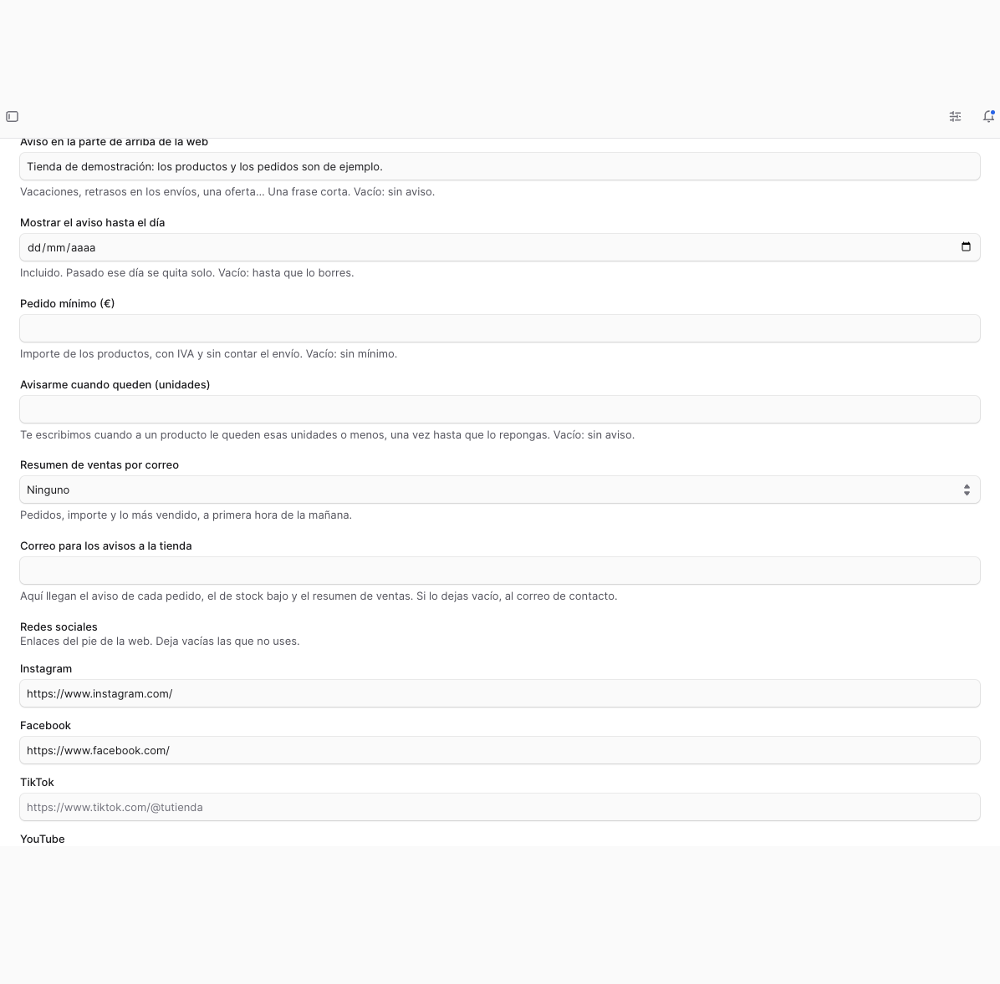

- **Cerrar la tienda temporalmente**: para vacaciones o un inventario. La web
  se sigue viendo y se puede navegar, pero nadie puede comprar. Quien estuviera
  pagando justo en ese momento recibe su pedido.
- **Aviso en la parte de arriba de la web**: una frase corta en una franja
  sobre toda la web. «Cerramos del 10 al 20 de agosto», «Los pedidos de esta
  semana salen el lunes». Con **Mostrar el aviso hasta el día**, se quita solo
  pasado ese día; sin fecha, se queda hasta que lo borres.
- **Pedido mínimo (€)**: el importe de los productos, con IVA y sin contar el
  envío, por debajo del cual no se puede comprar. Vacío: sin mínimo.
- **Avisarme cuando queden (unidades)**: te escribimos cuando a un producto le
  queden esas unidades o menos. Un aviso por producto, que no se repite hasta
  que lo repongas.
- **Resumen de ventas por correo**: ninguno, cada día (con las ventas del día
  anterior) o cada semana (los lunes). Pedidos, importe y lo más vendido, a
  primera hora.
- **Correo para los avisos a la tienda**: a dónde te mandamos el aviso de cada
  pedido, el de stock bajo y el resumen. Si lo dejas vacío, al correo de
  contacto.
- **Redes sociales**: los enlaces del pie de la web. Deja vacías las que no
  uses.

Al acabar, **Guardar ajustes**. La tienda los aplica en un minuto.

### 2.3 La portada

Debajo de los ajustes, **Portada**: lo primero que ve quien entra en tu tienda.

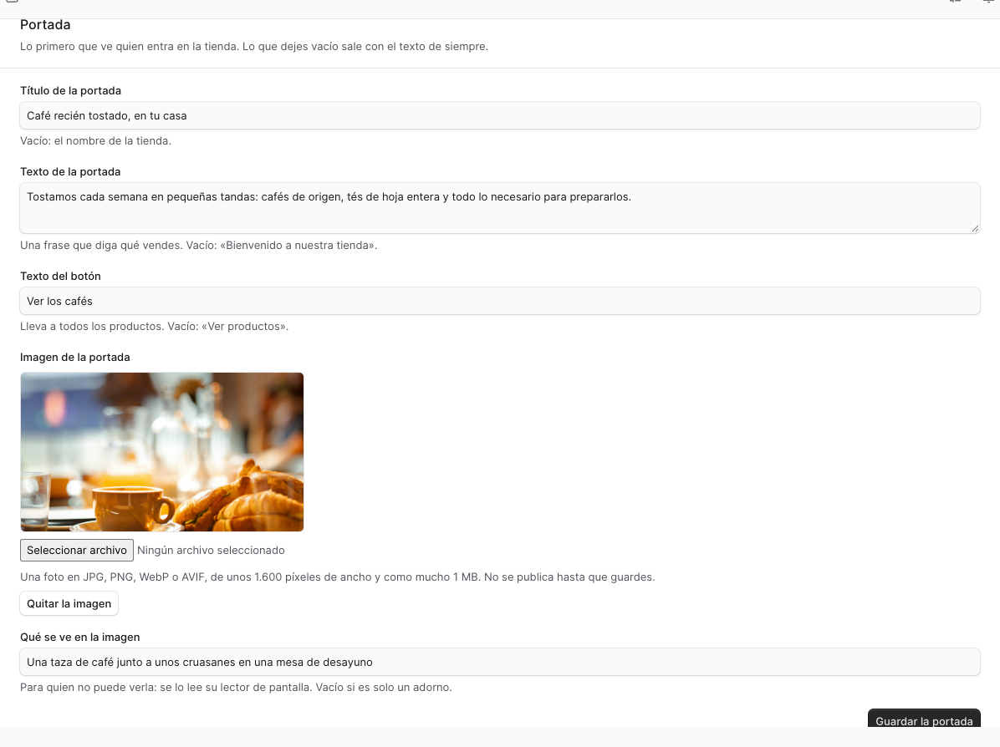

- **Título** y **Texto**: una frase que diga qué vendes. Si los dejas vacíos,
  sale el nombre de la tienda.
- **Texto del botón**: el botón lleva a todos los productos. Vacío: «Ver
  productos».
- **Imagen**: una foto apaisada, de unos 1.600 píxeles de ancho y de **1 MB
  como mucho**. Una foto recién sacada del móvil suele pesar más: redúcela
  antes. La imagen no se publica hasta que guardas.
- **Qué se ve en la imagen**: una frase para quien no puede verla, que se la
  lee su lector de pantalla. Vacío si es solo un adorno.

**Guardar la portada** y en un minuto está en la web.

### 2.4 Los envíos y el envío gratis

Las formas de envío (estándar, urgente) y sus precios están en
**Configuraciones → Ubicaciones & Envío**, dentro de tu almacén. Las dejamos
puestas al montar la tienda; lo normal es que solo cambies el precio.

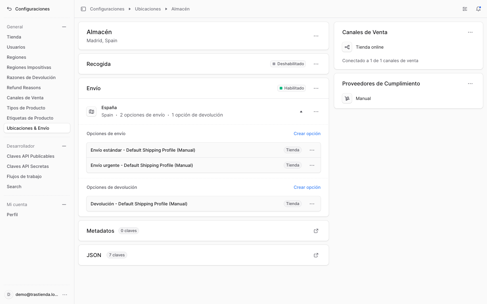

Para cambiar el precio de un envío: en la forma de envío, el menú **⋯** →
**Editar precios**. Sale una tabla: el precio que cuenta es el de la columna
**Precio España**. Escríbelo con el IVA incluido y pulsa **Guardar**.

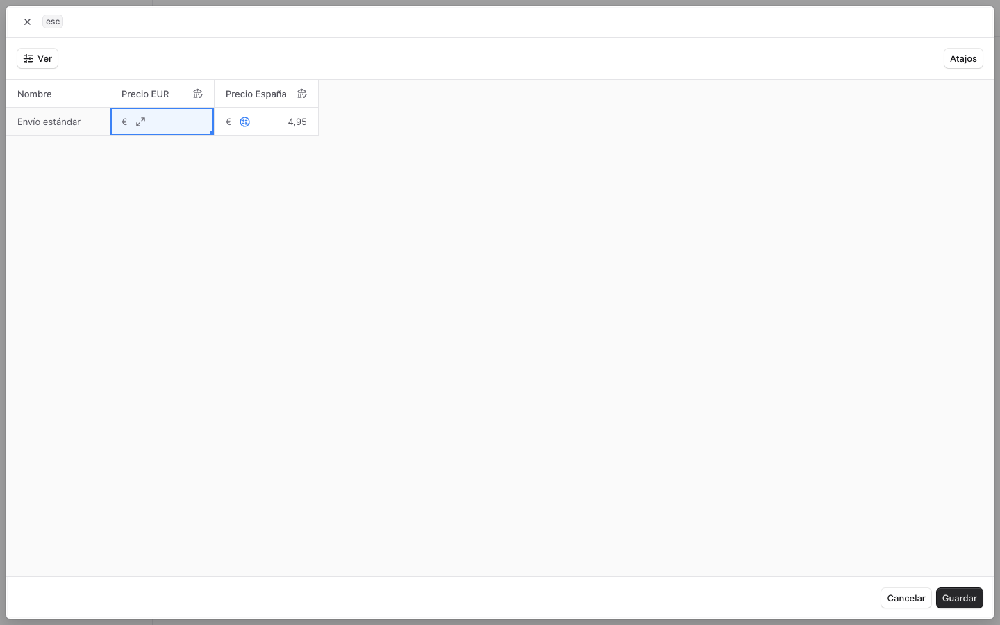

**Envío gratis a partir de un importe.** En esa misma tabla, en la casilla de
**Precio España**, pulsa el pequeño icono que aparece a la izquierda del
importe. Se abre **Precios Condicionales**:

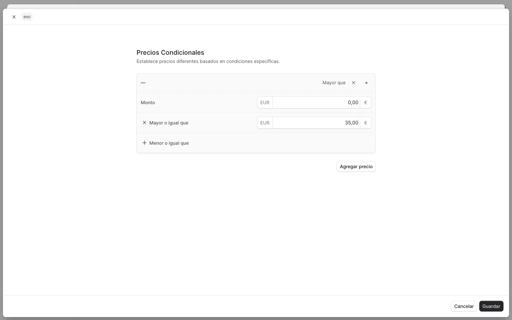

1. **Agregar precio**.
2. En **Monto**, `0`.
3. En **Mayor o igual que**, el importe a partir del cual el envío es gratis
   (por ejemplo, `35`).
4. **Guardar** aquí y **Guardar** en la tabla.

El importe que cuenta es el de los productos **con IVA y después de los
descuentos**: si un cupón deja el carrito por debajo, el envío vuelve a
cobrarse. La tienda enseña sola en el carrito cuánto le falta al cliente para
el envío gratis.

---

## 3. Pedidos

Es la pantalla que se abre al entrar. Los pedidos van del más nuevo al más
viejo, con dos columnas que dicen en qué punto está cada uno:

- **Pago**: **Capturado** es que ya está cobrado. El cobro se hace en el
  momento de la compra: no tienes que hacer nada.
- **Cumplimiento**: **No cumplido** (por preparar), **Enviado** o
  **Entregado**.

**Agregar filtro** deja ver, por ejemplo, solo los que están sin preparar.

### 3.1 La ficha de un pedido

Pulsa en un pedido para abrirlo.

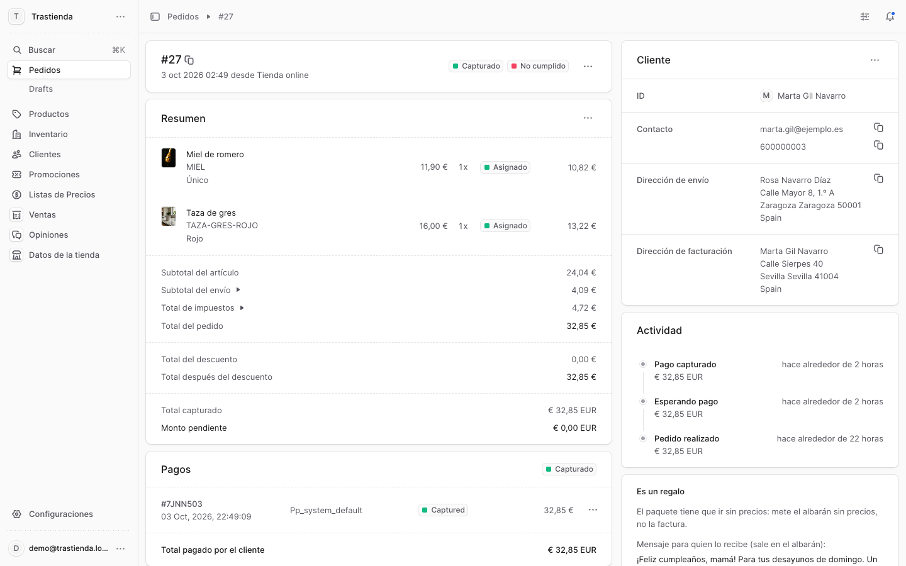

- **Resumen**: qué ha comprado, cuántas unidades y a qué precio, con el envío,
  el IVA y el total.
- **Pagos**: el cobro, con su importe.
- **Cliente**: su correo, su teléfono y las direcciones de envío y de
  facturación. Los iconos de la derecha copian cada dato.
- **Actividad**: todo lo que ha pasado con el pedido, en orden.

Abajo a la derecha, **Albarán**: el botón **Imprimir el albarán sin precios**
saca una hoja con la dirección y lo que va en el paquete, para meterla dentro.

### 3.2 Pedidos para regalo

Cuando el comprador marca que es un regalo, la ficha lo dice en el mismo sitio
del albarán, con el mensaje que haya escrito para quien lo recibe. El correo
del pedido nuevo también lo avisa en el asunto.

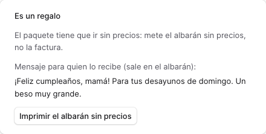

Un regalo **no lleva la factura ni nada con precios dentro del paquete**: mete
el albarán sin precios, que además imprime el mensaje. Ojo con la dirección:
la de envío suele ser la de otra persona, y la de facturación, la de quien
compra.

### 3.3 Preparar un pedido

Cuando tengas el paquete hecho, en la ficha del pedido, en **Artículos no
cumplidos**, el menú **⋯** → **Cumplir artículos**.

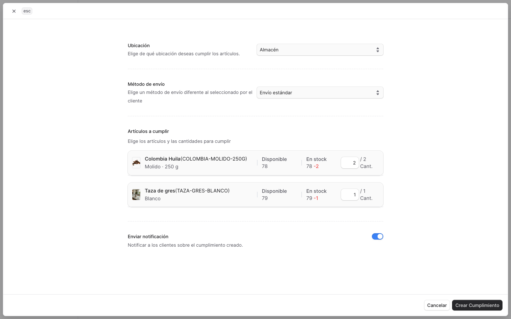

Viene todo rellenado: el almacén, la forma de envío que eligió el cliente y
todas las unidades. Si mandas solo una parte (porque algo te falta), baja las
unidades de lo que no va: lo demás se queda pendiente para otro paquete.

Pulsa **Crear Cumplimiento**. Las unidades se descuentan del stock y el pedido
queda preparado, esperando a salir.

### 3.4 Enviarlo

Cuando el paquete sale, en la tarjeta **Cumplimiento #1** de la ficha, pulsa
**Marcar como enviado**.

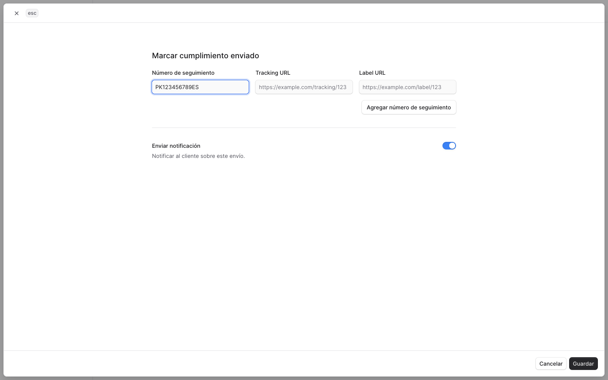

Si el transportista te da un número de seguimiento, pulsa **Agregar número de
seguimiento** y escríbelo. Deja **Enviar notificación** encendido y pulsa
**Guardar**: al cliente le llega un correo diciendo que su pedido va de
camino, con el número.

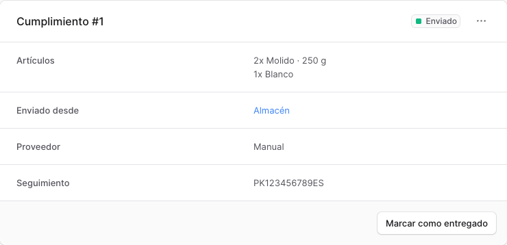

Cuando sepas que ha llegado, **Marcar como entregado**. No es un trámite: los
14 días que tiene el cliente para devolverlo se cuentan desde la entrega, y la
tienda solo le deja opinar del producto cuando el pedido está entregado.

Además, tus clientes pueden consultar en qué punto está su pedido desde la web,
en «¿Dónde está mi pedido?», con su número de pedido y su correo. Lo que ven
es lo que marques aquí.

### 3.5 Cancelar un pedido

Mientras no haya salido nada, se puede cancelar entero: en la ficha, el menú
**⋯** de arriba, junto al número del pedido → **Cancelar**.

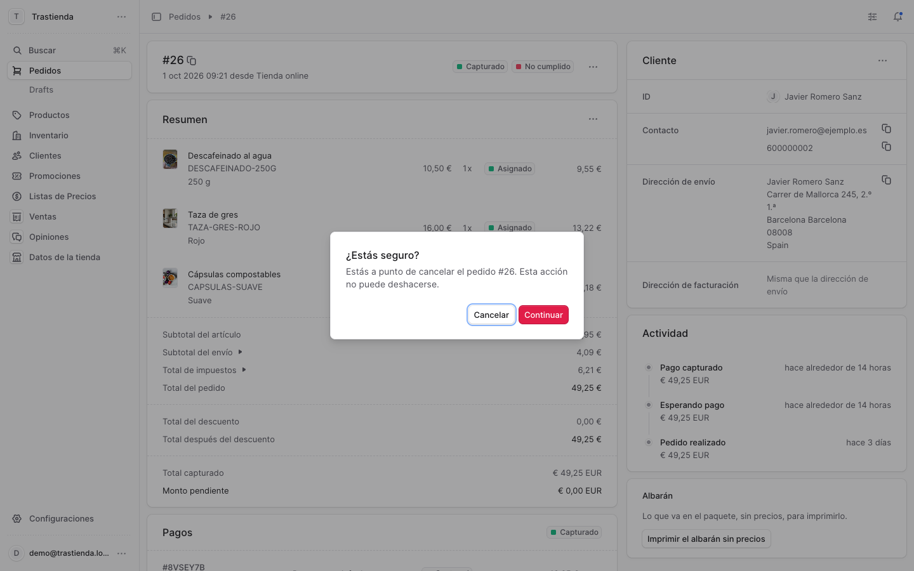

Al confirmar, **el dinero se le devuelve solo al cliente** por el mismo medio
con el que pagó, las unidades vuelven al stock y al cliente le llega un correo.
**No se puede deshacer.**

Si el cliente quiere quitar solo una parte antes del envío, es **Editar
pedido**, en el menú **⋯** de **Resumen**.

Si el pedido ya está preparado pero no ha salido, primero se cancela el
cumplimiento (menú **⋯** de **Cumplimiento #1** → **Cancelar**) y luego el
pedido.

El cliente también puede cancelar él mismo desde la web, mientras no hayas
preparado nada.

---

## 4. Devoluciones

Quien compra por internet tiene **14 días desde que recibe el pedido** para
devolverlo sin dar explicaciones. Es el derecho de desistimiento, y tu tienda
lo deja hacer desde la web, sin llamarte.

### 4.1 Cuando un cliente devuelve algo desde la web

El cliente entra en la página de desistimiento de tu tienda, pone su número de
pedido y su correo y elige qué devuelve. A él le llega un correo con el acuse
y la dirección a la que mandarlo.

**A ti no te llega ningún aviso**: lo ves en la ficha del pedido, en
**Resumen**, como «artículos de devolución solicitados», y en la
**Actividad**.

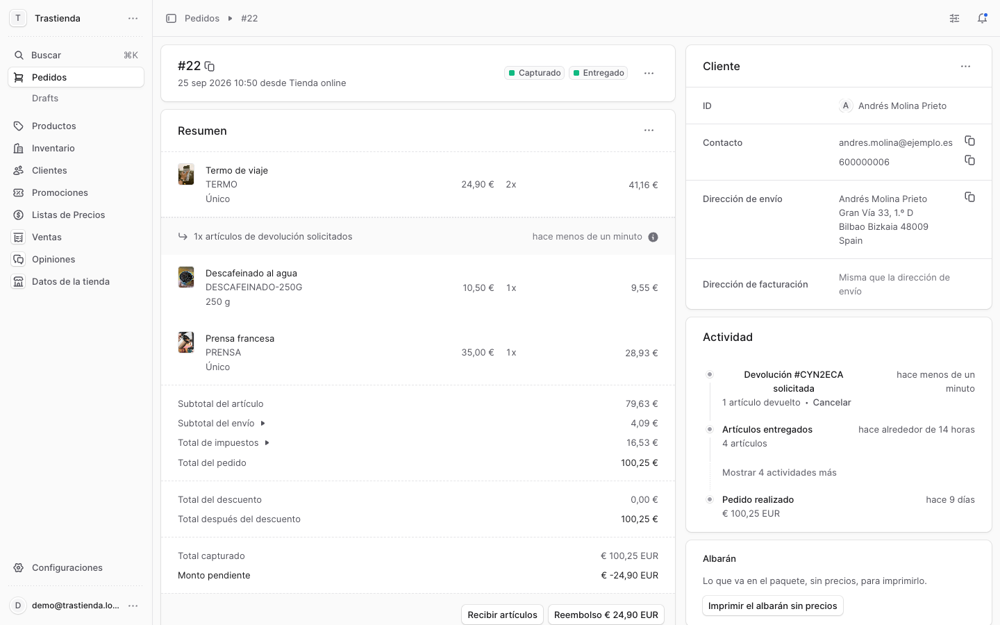

### 4.2 Recibir lo devuelto

Cuando el paquete te llega y lo has revisado, en la ficha del pedido pulsa
**Recibir artículos**.

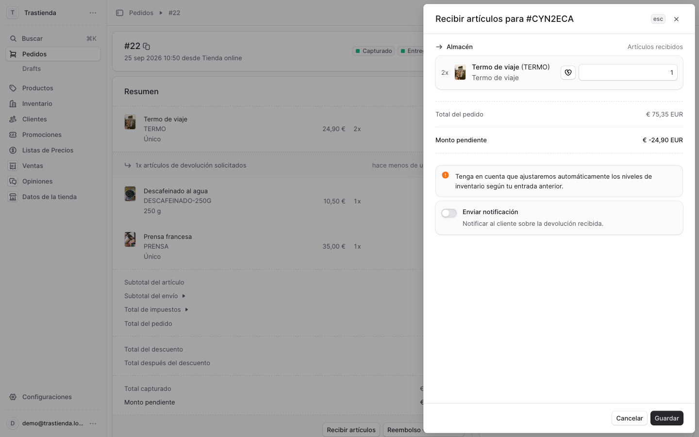

Comprueba las unidades y pulsa **Guardar**. Lo recibido vuelve al stock.

### 4.3 Devolver el dinero

Después de recibirlo, en la misma ficha aparece el botón **Reembolso**, con el
importe.

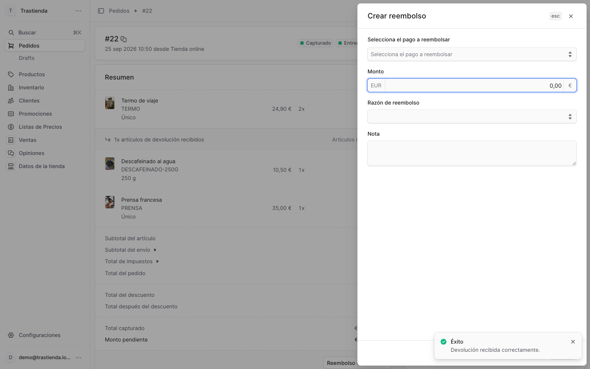

Elige el pago, comprueba el importe y pulsa **Guardar**. El dinero vuelve al
cliente por el mismo medio con el que pagó: no hay que hacer nada más en el
banco.

**Plazo**: la ley da **14 días desde que el cliente te comunica** que desiste
para devolverle el dinero. Puedes esperar a tener el paquete (o a que te
demuestre que lo ha enviado), pero no más. El importe incluye el envío que pagó
al comprar, salvo la parte que costara de más si eligió uno más caro que el
estándar.

### 4.4 Una devolución que te piden por teléfono o por correo

Si un cliente te escribe en vez de usar la web, la registras tú: en la ficha
del pedido, el menú **⋯** de **Resumen** → **Crear devolución**, eliges qué
devuelve y sigues igual: recibir y reembolsar.

---

## 5. Productos

**Productos** enseña el catálogo entero, con su estado (**Publicado** es que se
ve en la web).

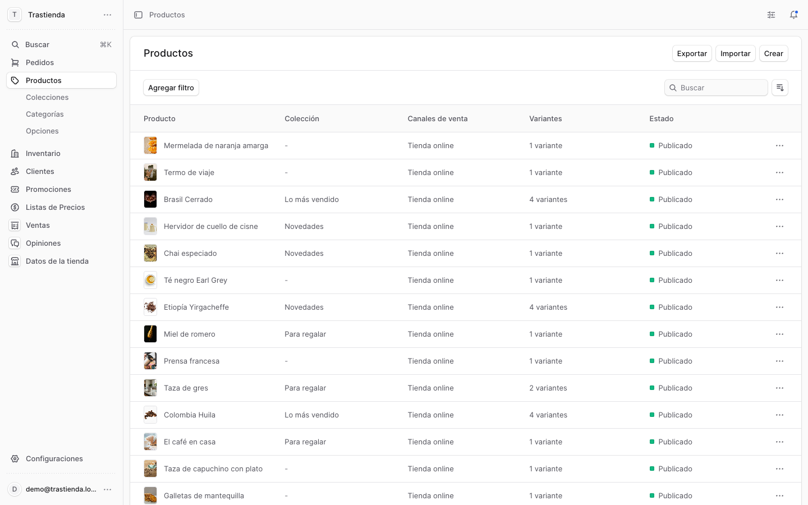

### 5.1 La ficha de un producto

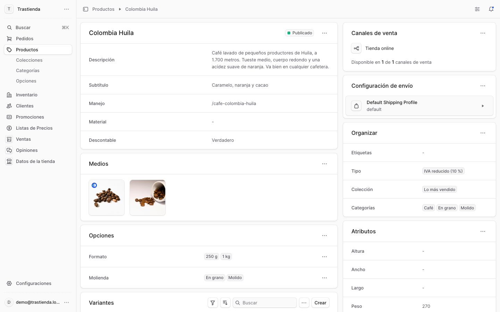

- Arriba, el nombre, la descripción y el **Subtítulo** (una línea corta que
  sale debajo del nombre).
- **Medios**: las fotos. La primera es la que sale en el catálogo.
- **Opciones** y **Variantes**: si el producto viene en varias tallas, colores
  o formatos, cada combinación es una variante, con su precio y su stock.
- **Organizar**, a la derecha: el tipo, la colección y las categorías.

Cada tarjeta tiene su menú **⋯** → **Editar** para cambiarla.

### 5.2 El tipo es el IVA

**Esto es lo más importante de la ficha.** En **Organizar**, el campo **Tipo**
dice qué IVA lleva el producto:

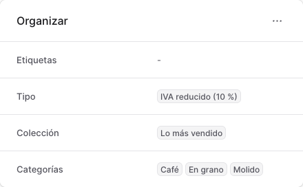

| Tipo | IVA | Para |
|---|---|---|
| *(vacío)* | 21 % | Lo general |
| **IVA reducido (10 %)** | 10 % | La mayoría de alimentos, por ejemplo |
| **IVA superreducido (4 %)** | 4 % | Pan, leche, libros… |

Un producto sin tipo paga el 21 %. Si un producto tuyo va a otro tipo y no
sabes cuál, pregúntaselo a tu gestoría antes de ponerlo a la venta. Para
agrupar productos en la web usa las **colecciones** y las **categorías**, nunca
el tipo.

### 5.3 Crear un producto

En **Productos**, **Crear**. Son tres pasos:

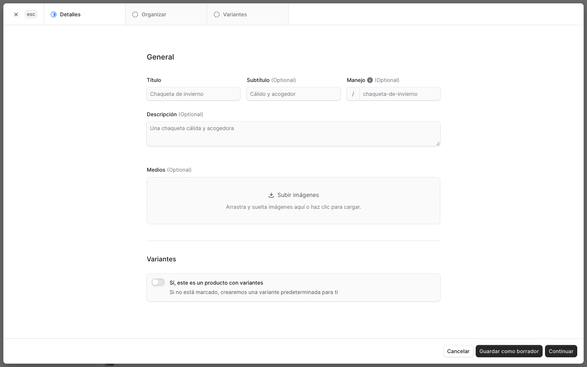

1. **Detalles**: el título, el subtítulo, la descripción y las fotos. Si el
   producto viene en varias tallas, colores o formatos, marca **Sí, este es un
   producto con variantes** y escribe las opciones (por ejemplo, «Formato»:
   250 g, 1 kg).
2. **Organizar**: el **Tipo** (el IVA, ver arriba), la colección y las
   categorías.
3. **Variantes**: el precio de cada variante, **con el IVA incluido**, que es
   el que verá el cliente.

**Guardar como borrador** lo deja sin publicar, para terminarlo otro día.
**Publicar** lo pone a la venta.

Las fotos: cuadradas o todas con la misma proporción, de al menos 1.000
píxeles de lado y sin texto encima.

### 5.4 Cambiar precios

En la ficha del producto, el menú **⋯** de **Variantes** → **Editar precios**.
Sale una tabla como una hoja de cálculo, con una fila por variante:

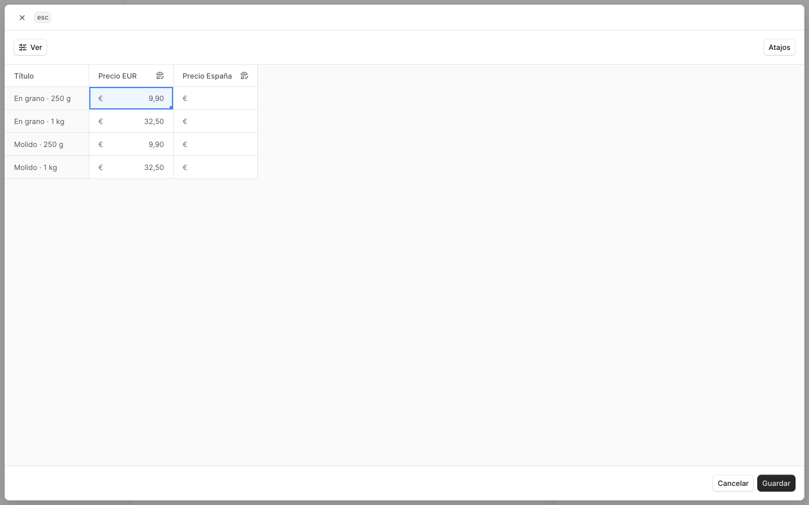

Cambia los importes de la columna **Precio España** (con IVA) y pulsa
**Guardar**. La web los enseña en unos segundos.

Bajar el precio aquí **no es una rebaja**: el precio nuevo sale sin tachar.
Para anunciar una rebaja, ver [Rebajas](#73-rebajas).

### 5.5 Preventa

Para vender algo antes de tenerlo. En la ficha del producto, abajo a la
derecha, **Preventa**: pon el día a partir del cual lo puedes enviar y pulsa
**Poner en preventa**.

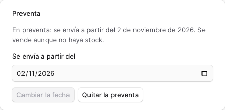

Mientras esté en preventa, se vende aunque no tengas stock, y la web dice a
partir de qué día se envía (la ley obliga a decirlo). **Quitar la preventa**
lo devuelve a la normalidad: solo se vende con stock.

Si no vas a poder enviar en esa fecha, avisa a quien lo compró: puede
cancelar el pedido.

### 5.6 Packs

Un pack (tres cafés, una caja de regalo) es un producto que se hace con otros
que ya tienes. Al crear su variante, con **Gestionar inventario** y **Kit de
Inventario** marcados, se eligen las piezas que lleva y cuántas de cada una. Así, el pack está disponible mientras
haya de todas sus piezas, y venderlo las descuenta del stock.

Un pack solo puede juntar productos **del mismo IVA**, y se le pone ese tipo.
Un pack de café (10 %) con una taza (21 %) no se puede hacer así: pregúntanos.

### 5.7 Colecciones y categorías

En el menú, debajo de **Productos**:

- **Categorías**: el árbol de la tienda (Café → En grano, Molido). Es el menú
  por el que navegan tus clientes.
- **Colecciones**: grupos que cruzan categorías («Novedades», «Para
  regalar»).

Un producto puede estar en varias categorías y en una colección.

---

## 6. Stock

### 6.1 Ver lo que queda

**Inventario** tiene una fila por cada cosa que guardas en el almacén (cada
variante de cada producto), con lo que tienes, lo reservado para pedidos aún
sin preparar y lo disponible.

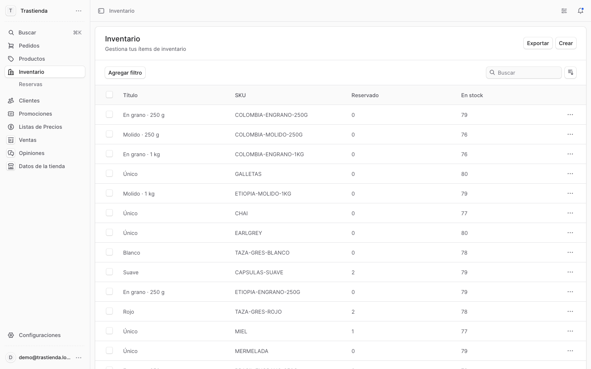

- **En stock**: lo que tienes en el almacén.
- **Reservado**: lo que ya está vendido en pedidos que aún no has preparado.
- **Disponible**: lo que se puede vender. Es lo que mira la web.

### 6.2 Cambiar las unidades

Cuando te llega mercancía: en **Inventario**, abre el artículo y, en
**Ubicaciones**, el menú **⋯** de tu almacén → **Editar**. Escribe las unidades
que tienes **en total** (no las que han llegado) y guarda.

También desde la ficha del producto: menú **⋯** de **Variantes** → **Editar
niveles de stock**, que deja cambiar todas las variantes de una vez.

### 6.3 Lo que hace la tienda con el stock

Todo esto va solo, sin tocar nada:

- Cuando quedan pocas unidades, la ficha del producto lo dice («Quedan 3»).
- Sin stock, el producto sale como agotado y no se puede comprar (salvo en
  [preventa](#55-preventa)).
- Si está agotado, el cliente puede pedir que le avisen cuando vuelva. Al
  reponerlo, la tienda les escribe sola.
- Si lo pediste en los ajustes, te avisa cuando un producto baja de las
  unidades que dijiste.

---

## 7. Clientes, cupones y rebajas

### 7.1 Clientes

**Clientes** son las personas que te han comprado o se han hecho una cuenta.
En la ficha de cada uno ves sus datos y todos sus pedidos.

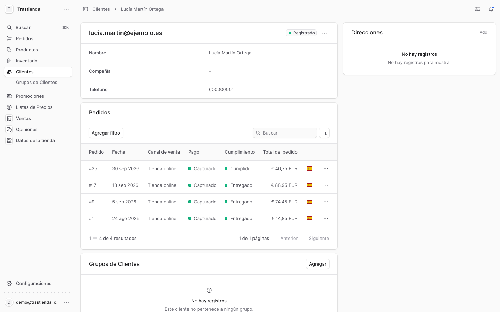

Se puede comprar sin cuenta. Quien compra como invitado aparece igual, con su
correo.

Si un cliente te pide que borres sus datos, no lo hagas desde aquí: la tienda
le deja borrar su cuenta desde la web, y lo hace como pide la ley (los pedidos
se conservan, porque hay que guardarlos para Hacienda, pero sin sus datos). Si
no tiene cuenta, escríbenos.

### 7.2 Cupones

**Promociones → Crear**. Primero se elige qué clase de descuento es:

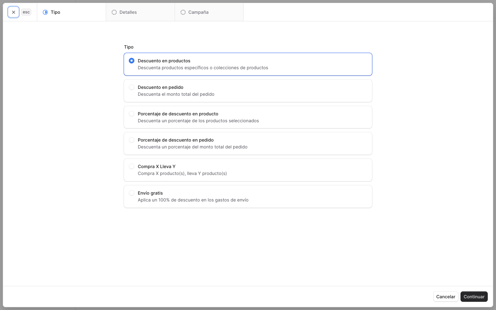

- **Descuento en pedido**: una cantidad fija del total (5 € de descuento).
- **Porcentaje de descuento en pedido**: un tanto por ciento del total.
- **Descuento en productos** y **Porcentaje de descuento en producto**: solo
  sobre los productos o colecciones que elijas.
- **Compra X Lleva Y**: el 3×2 y similares.
- **Envío gratis**: el envío a 0 con el código.

Después, en **Detalles**, el **código** que escribirá el cliente
(`BIENVENIDA5`) y el valor, y en las condiciones, a qué se aplica. Los
importes van **con IVA incluido**: un cupón de 5 € descuenta 5 € del precio que
ve el cliente.

Para dejar de ofrecer un cupón sin borrarlo, edítalo (menú **⋯** →
**Editar**) y cambia su estado.

### 7.3 Rebajas

Una rebaja es una **Lista de Precios**: unos precios rebajados para unos
productos, durante un tiempo. **Listas de Precios → Crear**:

1. **Tipo**: **Venta**. (La otra, **Anulación**, no es para rebajas.)
2. El nombre (solo lo ves tú), la descripción y, si quieres, la fecha de
   inicio y la de fin: la rebaja empieza y acaba sola.
3. Los productos y el precio rebajado de cada uno, con IVA.

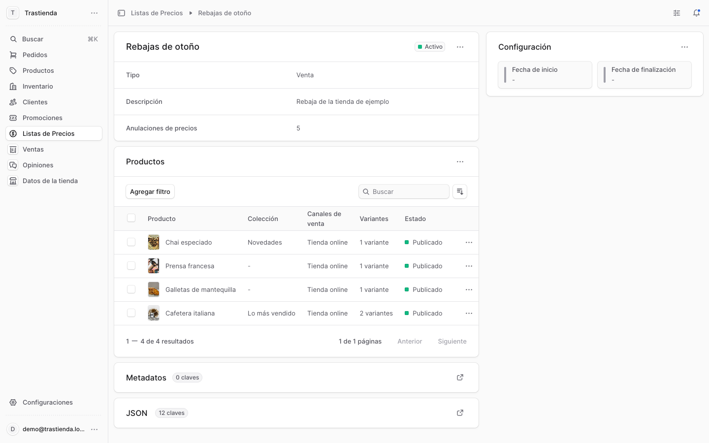

**El precio tachado lo pone la tienda, no tú.** La ley dice que el precio
«antes» de una rebaja tiene que ser el **más bajo de los 30 días anteriores**.
La tienda lleva la cuenta y tacha ese precio, con el porcentaje de descuento.
Si en los últimos 30 días el producto no ha estado más caro que ahora, no tacha
nada: no se puede anunciar como rebaja. Por eso no vale subir el precio una
semana antes y rebajarlo después: la tienda tacharía el precio de antes de la
subida.

---

## 8. Ventas y gestoría

**Ventas** dice cómo va la tienda en el periodo que elijas.

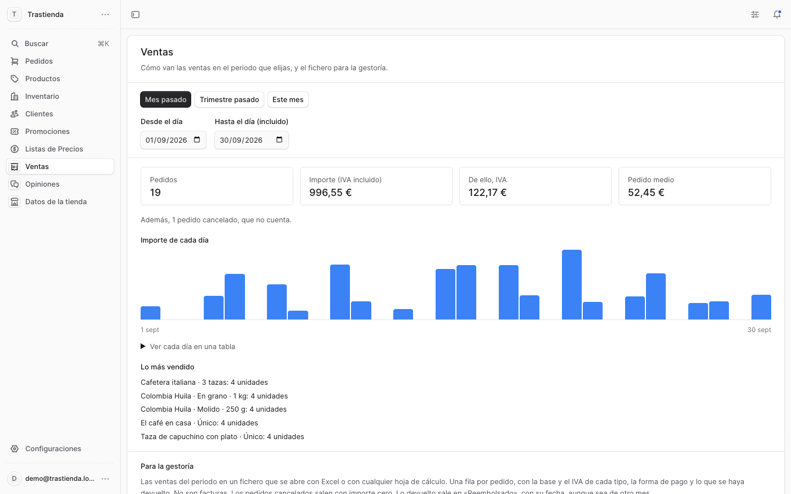

Arriba, tres atajos (**Mes pasado**, **Trimestre pasado**, **Este mes**) o dos
fechas a tu gusto. Debajo:

- **Pedidos**, **Importe (IVA incluido)**, **De ello, IVA** y **Pedido medio**.
  Los cancelados no cuentan, y se dice cuántos hubo.
- **Importe de cada día**, en barras. **Ver cada día en una tabla** lo da en
  números.
- **Lo más vendido**, en unidades.

### Para la gestoría

Al final de la página, **Descargar el fichero**: las ventas del periodo en un
fichero que se abre con Excel o con cualquier hoja de cálculo. Una fila por
pedido, con la base y el IVA de cada tipo, la forma de pago y lo devuelto.

- **No son facturas**: es el resumen para que tu gestoría lleve las cuentas.
- Los pedidos cancelados salen con importe cero.
- Lo devuelto sale en la columna «Reembolsado», con su fecha, aunque sea de
  otro mes.

Lo normal es descargar **Trimestre pasado** al acabar cada trimestre y
mandárselo. La primera vez, pregúntale si le sirve tal cual.

---

## 9. Opiniones

Solo puede opinar quien **compró el producto y ya lo ha recibido**: la tienda
lo comprueba con su número de pedido. Y **ninguna opinión se ve en la web
hasta que la publicas tú**. Te llega un correo con cada una.

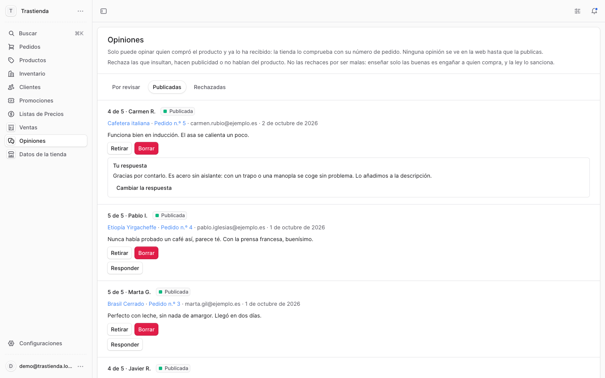

Tres pestañas: **Por revisar** (con cuántas hay), **Publicadas** y
**Rechazadas**. En cada opinión:

- **Publicar**: sale en la ficha del producto en un minuto.
- **Rechazar** (o **Retirar**, si ya estaba publicada): deja de verse, pero se
  guarda.
- **Borrar**: la quita del todo.
- **Responder**: tu respuesta sale debajo de la opinión, en público. Vacía, se
  quita.

**Qué rechazar**: lo que insulta, lo que hace publicidad y lo que no habla del
producto. **Qué no rechazar**: una opinión mala por ser mala. La web dice que
las opiniones son de compradores comprobados y que se revisan; enseñar solo las
buenas engaña a quien compra, y la ley lo sanciona. A una opinión mala, lo que
mejor funciona es contestarla.

---

## 10. Avanzado

Lo que se toca una vez, o casi nunca.

### 10.1 Más personas en el panel

**Configuraciones → Usuarios → Invitar**. Escribe su correo y le llega una
invitación para crear su contraseña. Cada persona, su cuenta: así la
**Actividad** de cada pedido dice quién hizo qué.

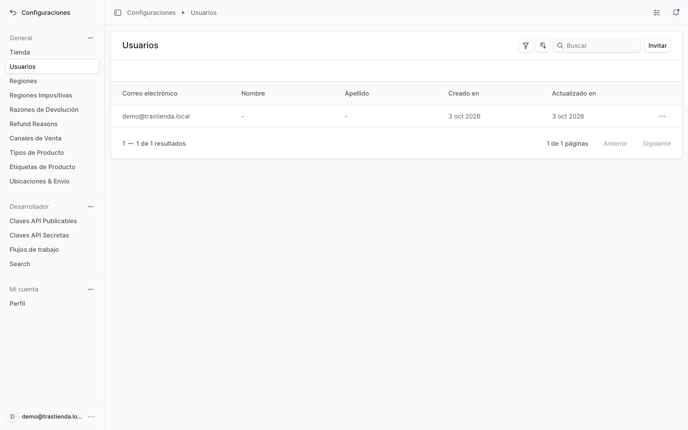

Todas las cuentas pueden hacerlo todo. Cuando alguien deje de llevar la tienda,
bórrale la cuenta desde la misma página (menú **⋯** → **Eliminar**).

### 10.2 Lo que no se toca

En **Configuraciones** hay apartados que montamos nosotros y que, cambiados,
pueden dejar la tienda sin cobrar bien o sin enviar:

- **Regiones** y **Regiones Impositivas**: el país, la moneda y los tipos de
  IVA.
- **Canales de Venta** y **Claves API Publicables** o **Secretas**: lo que une
  el panel con la web.
- **Flujos de trabajo** y **Search**: el funcionamiento interno.
- **Tienda**: la moneda. Los precios con IVA incluido tienen que seguir así.

Si crees que hay que cambiar algo de ahí, escríbenos antes.

### 10.3 Si algo va mal

- **Un cambio no se ve en la web**: espera un par de minutos y recarga la
  página. Los datos legales tardan hasta cinco.
- **Un cliente dice que no le ha llegado el correo**: que mire en correo no
  deseado. En la ficha del pedido, en **Cliente**, comprueba que el correo esté
  bien escrito; si no lo está, menú **⋯** → **Correo electrónico** para
  corregirlo.
- **Un pedido sale cobrado pero el cliente dice que no ha pagado**, o al
  revés: no hagas nada en el panel y escríbenos con el número del pedido.
- **El panel da un error al guardar**: anota qué estabas haciendo y escríbenos.
  No lo repitas varias veces seguidas.

Para cualquier otra cosa, escríbenos. Cuanto más concreto (qué pedido, qué
producto, qué pantalla), antes se arregla.
